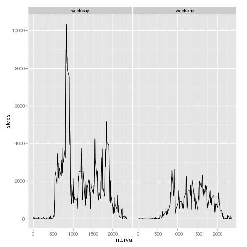

# Reproducible Research: Peer Assessment 1


## Loading and preprocessing the data

The data for this assignment is in the related github repository and is assumed to be in the current working directory in [activity.zip](activity.zip).

To load the data it must first be unzipped.


```r
unzip("activity.zip")
```

With the data unzipped we can now load the csv file.


```r
activity <- read.csv("activity.csv")
```

Lets make sure that worked by checking a summary of the data.


```r
summary(activity)
```

```
##      steps               date          interval   
##  Min.   :  0.0   2012-10-01:  288   Min.   :   0  
##  1st Qu.:  0.0   2012-10-02:  288   1st Qu.: 589  
##  Median :  0.0   2012-10-03:  288   Median :1178  
##  Mean   : 37.4   2012-10-04:  288   Mean   :1178  
##  3rd Qu.: 12.0   2012-10-05:  288   3rd Qu.:1766  
##  Max.   :806.0   2012-10-06:  288   Max.   :2355  
##  NA's   :2304    (Other)   :15840
```

## What is mean total number of steps taken per day?

To investigate the total number of steps per day we will first need to calculate those values.


```r
steps.per.day <- aggregate(formula = steps ~ date, FUN = sum, data = activity)
head(steps.per.day)
```

```
##         date steps
## 1 2012-10-02   126
## 2 2012-10-03 11352
## 3 2012-10-04 12116
## 4 2012-10-05 13294
## 5 2012-10-06 15420
## 6 2012-10-07 11015
```

The summary function will give us both the mean and median steps per day.


```r
summary(steps.per.day$steps)
```

```
##    Min. 1st Qu.  Median    Mean 3rd Qu.    Max. 
##      41    8840   10800   10800   13300   21200
```

A histogram may provide additional insight into these numbers


```r
with(steps.per.day, hist(steps))
```

 

## What is the average daily activity pattern?

To caclculate the pattern we will take average number of steps per inverval for each day.


```r
pattern <- aggregate(formula = steps ~ interval, FUN = "mean", data = activity)
head(pattern)
```

```
##   interval   steps
## 1        0 1.71698
## 2        5 0.33962
## 3       10 0.13208
## 4       15 0.15094
## 5       20 0.07547
## 6       25 2.09434
```

Let's plot this as a time series and see what the pattern looks like.


```r
with(pattern, plot(interval, steps, type = "l"))
```

 

It may also be interesting to see what 5 minute interval, on average, has the most steps.


```r
pattern[pattern$steps == max(pattern$steps),]
```

```
##     interval steps
## 104      835 206.2
```

## Imputing missing values

The data does have some missing values. This can be shown by counting the number of data points that are NA.


```r
sum(is.na(activity$steps))
```

```
## [1] 2304
```

To address this I will create a function that will take an input a vecorized row from the activity dataframe. This function will check to see if the data is na. If the data is na then it will return the average number of steps for that interval (that we calculated earlier). If the data isn't na then the actual value is returned.


```r
na.strategy <- function (row, p){
	steps <- row[1]
	interval <- as.numeric(row[3])
	if(is.na(steps)){
		return(p[p$interval == interval, 'steps'])
	} 
	steps
}
```

Let's test this with the first row of data from activity.


```r
test.row <- activity[1,]
na.strategy(test.row, pattern)
```

```
## [1] 1.717
```

```r
pattern[pattern$interval == test.row$interval,]
```

```
##   interval steps
## 1        0 1.717
```

With some assurance that it works we can use this with apply to generate a new vector of steps that has no NAs.


```r
steps.no.missing <- apply(activity, 1, na.strategy, p = pattern)
str(steps.no.missing)
```

```
##  chr [1:17568] "1.71698113207547" "0.339622641509434" ...
```

For some reason the resulting vector is a character vector. Let's transform that to a numeric vector.


```r
steps.no.missing <- as.numeric(steps.no.missing)
str(steps.no.missing)
```

```
##  num [1:17568] 1.717 0.3396 0.1321 0.1509 0.0755 ...
```

With this new vector of steps in hand let's create a new data frame that contains that vector.


```r
activity.no.missing <- data.frame(steps.no.missing, activity$date, activity$interval)
colnames(activity.no.missing) <- c("steps", "date", "interval")
str(activity.no.missing)
```

```
## 'data.frame':	17568 obs. of  3 variables:
##  $ steps   : num  1.717 0.3396 0.1321 0.1509 0.0755 ...
##  $ date    : Factor w/ 61 levels "2012-10-01","2012-10-02",..: 1 1 1 1 1 1 1 1 1 1 ...
##  $ interval: int  0 5 10 15 20 25 30 35 40 45 ...
```

With the new data in place let's take a look at how this corresponds with the first set of analysis we did--looking at steps per day.


```r
steps.per.day <- aggregate(formula = steps ~ date, FUN = sum, data = activity.no.missing)
summary(steps.per.day$steps)
```

```
##    Min. 1st Qu.  Median    Mean 3rd Qu.    Max. 
##      41    9820   10800   10800   12800   21200
```

```r
with(steps.per.day, hist(steps))
```

 

Interestingly the mean and medians did not change. However, you can see in the histogram that the frequencies have increased by a similar proportion in all ranges. 

## Are there differences in activity patterns between weekdays and weekends?

To investigate weekdays versus weekends we first need to categorize all of our data. To aid with this we'll write a function that takes a date as an input and outputs a string of "weekday" or "weekend".


```r
to.weekday.or.weekend <- function(input){
	day <- as.character(weekdays(input))
	if (day == "Saturday" || day == "Sunday"){
		return("weekend")
	}
	"weekday"
}
```

To test this let's compare this to the results of the weekdays function.


```r
weekdays(.leap.seconds)
```

```
##  [1] "Saturday"  "Monday"    "Tuesday"   "Wednesday" "Thursday" 
##  [6] "Saturday"  "Sunday"    "Monday"    "Tuesday"   "Wednesday"
## [11] "Thursday"  "Friday"    "Monday"    "Friday"    "Monday"   
## [16] "Tuesday"   "Wednesday" "Thursday"  "Friday"    "Monday"   
## [21] "Tuesday"   "Friday"    "Sunday"    "Thursday"
```

```r
sapply(.leap.seconds, to.weekday.or.weekend)
```

```
##  [1] "weekend" "weekday" "weekday" "weekday" "weekday" "weekend" "weekend"
##  [8] "weekday" "weekday" "weekday" "weekday" "weekday" "weekday" "weekday"
## [15] "weekday" "weekday" "weekday" "weekday" "weekday" "weekday" "weekday"
## [22] "weekday" "weekend" "weekday"
```

Unfortunately the dates in our data is a factor instead of a date. We'll need to do some conversion.


```r
dates <- as.Date(as.character(activity.no.missing$date))
str(dates)
```

```
##  Date[1:17568], format: "2012-10-01" "2012-10-01" "2012-10-01" "2012-10-01" ...
```

Let's apply all of this to our data and append the result to our data.


```r
week.category <- sapply(dates, to.weekday.or.weekend)
week.category <- factor(week.category)
activity.no.missing$week.category <- week.category
str(activity.no.missing)
```

```
## 'data.frame':	17568 obs. of  4 variables:
##  $ steps        : num  1.717 0.3396 0.1321 0.1509 0.0755 ...
##  $ date         : Factor w/ 61 levels "2012-10-01","2012-10-02",..: 1 1 1 1 1 1 1 1 1 1 ...
##  $ interval     : int  0 5 10 15 20 25 30 35 40 45 ...
##  $ week.category: Factor w/ 2 levels "weekday","weekend": 1 1 1 1 1 1 1 1 1 1 ...
```

Now, we can take this data an look how the averages compare on weekend and weekdays.


```r
steps.per.category <- aggregate(formula = steps ~ interval + week.category, FUN = sum, data = activity.no.missing)
head(steps.per.category)
```

```
##   interval week.category   steps
## 1        0       weekday 101.302
## 2        5       weekday  20.038
## 3       10       weekday   7.792
## 4       15       weekday   8.906
## 5       20       weekday   4.453
## 6       25       weekday  71.566
```

```r
require(ggplot2)
```

```
## Loading required package: ggplot2
## Loading required package: reshape
## Loading required package: plyr
## 
## Attaching package: 'reshape'
## 
## The following object(s) are masked from 'package:plyr':
## 
##     rename, round_any
## 
## Loading required package: grid
## Loading required package: proto
```

```r
qplot(interval, steps,
					 data = steps.per.category,
					 facets = . ~ week.category,
					 geom = "line")
```

 
